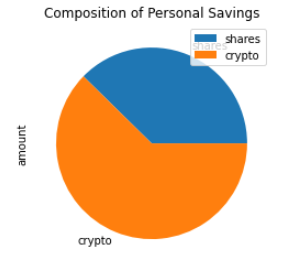
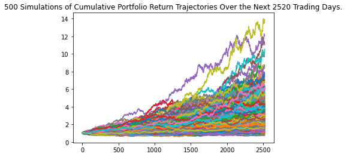
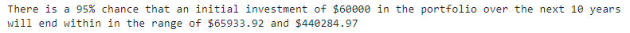

# Unit 5 - Financial Planning
 

### This repository is to create two financial analysis tools utilising APIs. 

---

The first tool is a personal finance planner that allows users to see their savings, made up of stock and cryptocurrency assets, to determine if they have enough money set aside for an emergency fund.

The second product is a retirement planning tool that uses Alpaca APIs to retrieve historical closing prices for a stock and bond retirement portfolio. Then run Monte Carlo simulations to estimate portfolio performance over various timeframes and project portfolio returns for a particular starting balance.

---
## Early retirement challenge

These results show that those with a high risk preference have the potential  to retire early with a higher stock to bond ratio and a more significant initial investment. 

---

## Built with
* python
* pandas
* alpaca
* matplotlib
* MCForecastTools
---

